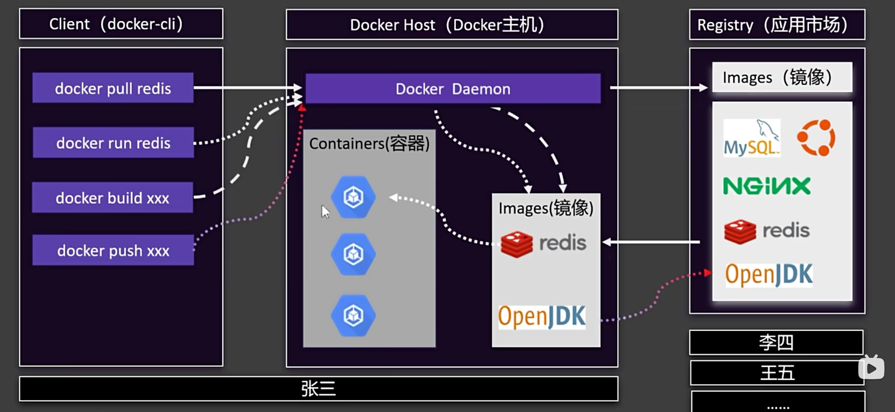
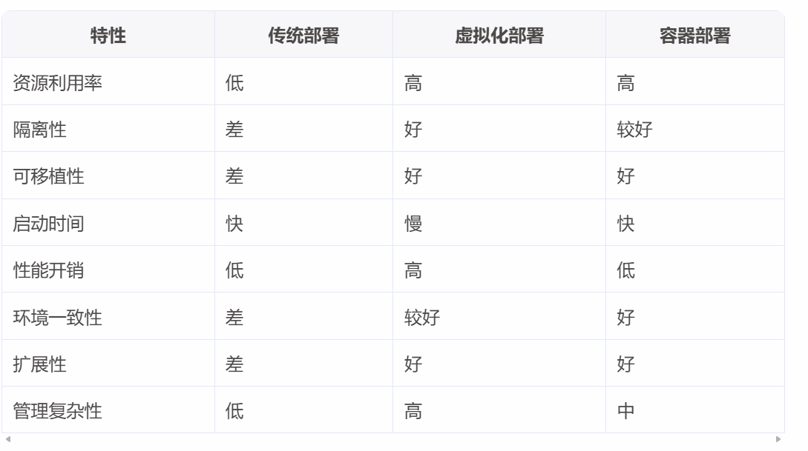
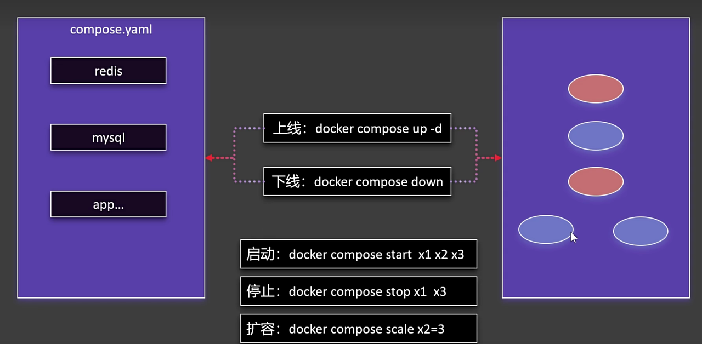
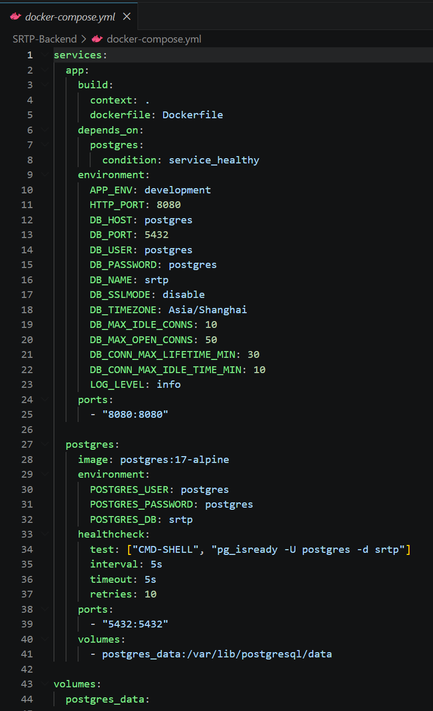
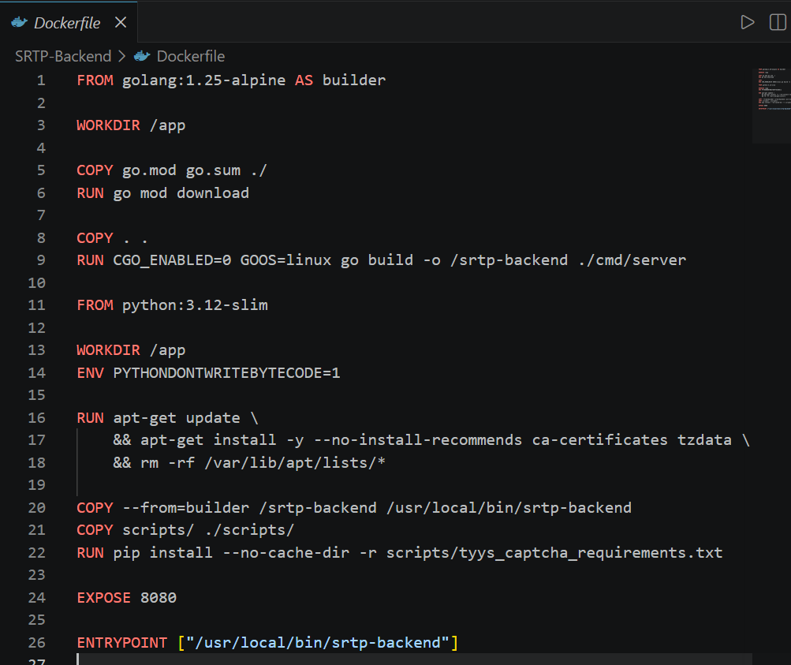

# 技术分享：Docker 入门

> 资料来源：\
> csdiy.wiki\
> 尚硅谷 Docker 快速通关学习笔记 | 時光\


# 前情提要：为什么要使用docker？
//来自csdiy\
配环境的折磨会极大消磨大家对软件、编程的兴趣。诚然，虚拟机可以解决配环境的一大部分问题，但是虚拟机庞大笨重，且为了某个应用的环境配置好像也不值得模拟一个全新的操作系统。

Docker 的出现让环境配置变得（或许）不再折磨。简单来说，Docker 使用轻量级的“容器”（container）而不是整个操作系统去支持一个应用的配置。应用自身连同它的环境配置被打包为一个个可以自由运行在不同平台 container 中的 image，这极大地节省了所有人的时间成本。

# 什么是docker？
Docker 是一个开源的容器化平台，它允许开发者将应用程序及其依赖项打包到一个轻量级的、可移植的容器中。

# 为什么是docker?
- 一致的环境
  - 所有的依赖项和配置都打包在容器中，因而无论在哪个环境中，应用程序的行为都是相同的，避免了环境差异导致的运行问题，并保证了开发与生产环境的一致性
- 隔离性
  - 可以运行多个独立容器，每个容器可以有自己的依赖项和配置，不会影响其他容器。
  - 容器内的应用程序不会直接访问宿主机的资源，确保了安全性。
- 可移植性
- 快速部署与扩展
  - 快速启动。
  - Docker 容器可以轻松地进行水平扩展，通过启动多个容器实例来处理更多的请求。
- 版本控制与依赖管理
  - Docker 镜像可以进行版本控制，开发者可以轻松地回滚到之前的版本，或者在不同的版本之间切换。
  - Docker 镜像包含了应用程序的所有依赖项，确保在不同的环境中运行时不会缺少任何依赖。
- 资源效率
  - 它们共享宿主机的操作系统内核，而不是每个容器都运行一个完整的操作系统。
- 社区和生态系统
  - Docker Hub 提供了大量的公共镜像，开发者可以直接使用这些镜像来快速构建应用程序。
  - Docker 有庞大的社区支持和丰富的工具链，如 Kubernetes、Docker Compose 等，可以帮助开发者更高效地管理和部署容器化应用。

# Docker 组件


# Docker CLI
**定义**：与用户交互的主要工具，提供了一组命令，允许用户管理docker镜像、容器、网络和存储等资源。

**作用**： 用户通过 Docker CLI 发送命令，命令被发送到 Docker Host 进行处理

**示例**： 
```bash
docker run
docker build
docker pull
docker push
```

# Docker Host（Docker守护进程）
**定义**： Docker Host 是运行 Docker 守护进程（dockerd）的机器。守护进程负责管理 Docker 对象，如容器、镜像、网络和卷等。

**作用**： Docker Host 接收来自 Docker CLI 的命令，并执行相应的操作。它还负责与 Docker 注册表（仓库）进行通信，以拉取或推送镜像。

**关系**： Docker Host 是 Docker CLI 和 Docker 容器之间的桥梁
## Container
**定义**： 容器是 Docker 中的运行实例，它是基于镜像创建的。容器包含了应用程序及其所有依赖项，并且与宿主机和其他容器隔离。

**关系**： 容器是基于镜像创建的，并且由 Docker Host 管理。容器可以被启动、停止、删除和迁移。
## Image（镜像）
**定义**： 镜像是用于创建容器的只读模板。它包含了运行应用程序所需的所有文件、库、配置和依赖项。

**作用**： 镜像是容器的构建块，它定义了容器的行为和环境。镜像可以通过 Dockerfile 构建，也可以从 Docker 仓库中拉取。
**关系**： 镜像是容器的蓝图，容器是镜像的运行实例。镜像可以被推送到 Docker 仓库，也可以从仓库中拉取。
## Registry（仓库）
**定义**：仓库是存储和分发 Docker 镜像的地方。Docker Hub 是最常用的公共仓库，但也可以使用私有仓库。

**作用**：仓库允许用户共享和分发镜像，使得团队成员可以轻松获取和使用相同的镜像。

**关系**：Docker Host 可以从仓库中拉取镜像，也可以将本地构建的镜像推送到仓库。Docker CLI 提供了 `docker pull` 和 `docker push` 命令来与仓库交互。

> - Docker CLI 是用户与 Docker 交互的接口，用户通过它发送命令。
> - Docker Host 是运行 Docker 守护进程的机器，负责处理 Docker CLI 的命令并管理容器和镜像。
> - 容器 是基于镜像创建的运行实例，由 Docker Host 管理。
> - 镜像 是容器的只读模板，定义了容器的行为和环境。
> - 仓库 是存储和分发镜像的地方，Docker Host 可以从仓库中拉取镜像，也可以将本地镜像推送到仓库。

# 应用程序部署方式
- 传统部署：直接安装在物理服务器上，使用服务器的操作系统及其资源
- 虚拟化部署：运行在虚拟机（VM）中
- 容器部署：运行在容器中，容器共享宿主机的操作系统内核。


# Docker Compose
> compose.yml
>
> 官方文档：
>
> https://docs.docker.com/reference/compose-file/


**Docker Compose** 是一个用于定义和运行多容器 Docker 应用程序的工具。通过使用 YAML 文件来配置应用程序的服务、网络和卷，Docker Compose 可以轻松地启动、停止和管理多个容器。

> .yaml的作用？
> - 定义服务（启动哪些容器）
> - 配置环境：写好端口等等
> - 管理依赖
> - 一键启动


👆👆约球系统的.yaml

# 常用命令：
`docker-compose up`

**功能**： 启动服务\
**常用选项**： 
- `-d`：在后台运行服务
- `--build`：在启动服务之前构建image
- `--force-recreate`：强制重新创建容器，即使它们的配置和镜像没有改变

**示例**： 

`docker compose up -d postgres`\
`postgres`：只启动名为 postgres 的这一个服务，不启动 compose 文件里的其他服务。（写在docker-compose.yml文件里）


`docker-compose down` \
**功能**： 停止并删除服务\
**常用选项**： 
- `-v`：删除与服务关联的卷
- `--rmi all`：删除所有与服务关联的镜像

`docker-compose ps`\
**功能**： 列出正在运行的服务

`docker-compose logs`\
**功能** ：查看服务的日志。\
**常用选项**： 
- `-f`：实时跟踪日志输出。
- `--tail=N`：只显示最后 N 行日志。

`docker-compose build`\
**功能**：构建服务镜像。\
**常用选项**：
- `--no-cache`：不使用缓存构建镜像。

`docker-compose exec`\
**功能**：在运行的容器中执行命令。\
**示例**： \
`docker compose exec postgres psql -U postgres -d srtp`\
`docker-compose start`\
**功能**：启动已停止的服务。

`docker-compose stop`\
**功能**：停止正在运行的服务。

`docker-compose restart`\
**功能**：重启服务。

`docker-compose pull`\
**功能**：拉取服务的镜像。

`docker-compose config`\
**功能**：验证并查看 docker-compose.yml 文件的配置。

`docker-compose run`\
**功能**：运行一次性命令。\
**常用选项**：\
-` -e`：设置环境变量。\
-`--rm`：命令完成后删除容器。

`docker-compose scale`\
**功能**：扩展服务的实例数量。

`docker-compose port`\
**功能**：查看服务的端口映射。

`docker-compose port web 80`\
`docker-compose top`\
**功能**：查看正在运行的进程。

# Dockerfile
如果你想把你的项目变成一个可以随处运行的镜像，你就需要写 Dockerfile。\
它是一个文本文件，包含了一系列指令，告诉 Docker 按照什么步骤来打包你的应用。

> 官方文档：https://docs.docker.com/reference/dockerfile/

- 核心作用：解决“如何把我的源码和依赖变成一个镜像”的问题。
- 常用指令：
  - `FROM`：基于哪个“底座”（比如 `golang:1.22`）。
  - `COPY`：把你的代码拷贝进镜像。
  - `RUN`：执行命令（比如 `go build`）。
  - `CMD`：镜像启动后默认运行什么程序。


👆👆👆约球系统的Dockerfile
# 来玩一下！
启动一个nginx ，将它的首页改成自己的页面！
## STEP 0: 前置条件
确保你已经打开了docker ！
## STEP 1: 下载镜像
### 搜索镜像
`docker search nginx`
### 下载
`docker pull nginx`
## STEP 2: 启动容器
`docker run -d -p 8080:80 --name my-nginx nginx`
- `-d`：后台运行，防止终端被nginx的日志占满
- `-p` 8080:80: 端口映射，左边是电脑端口，右边是nginx的端口
- `--name`:起个名字
- `nginx`: 告诉docker启动哪个镜像
## STEP 3: 验证成功
`docker ps`
### 看到状态是up
浏览器打开http://localhost:8080
## STEP 4: 修改首页
`docker exec my-nginx sh -c "echo '<h1>Hello, Docker! This is my own page.</h1>' > /usr/share/nginx/html/index.html"`
## STEP 5: 结束
`docker rm -f my-nginx`

# 练习

- [ ] 为一个 Node 服务写最小 Dockerfile。
- [ ] 解释 `-p 8080:8080` 的两端分别代表什么。
- [ ] 使用 Compose 启动应用和数据库，并记录环境变量来源。

# 学习衔接

先完成[Shell 与 Linux 基础](shell-basics.md)，再将容器用于项目；服务维护参考[运维实践](sharing-operations.md)。


